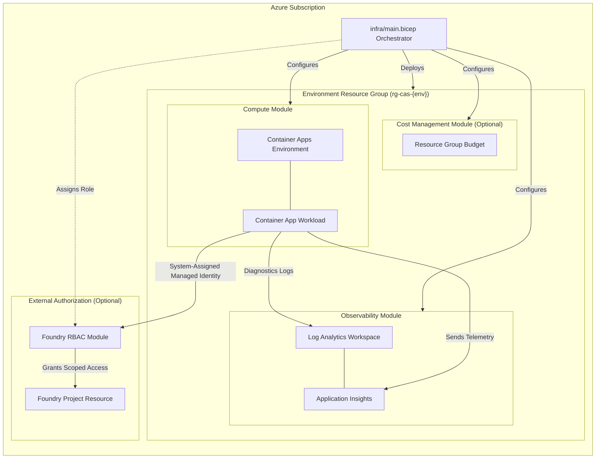

# Architecture

The CAS Platform infrastructure relies on a modular, subscription-scoped orchestration model built with Azure Bicep. It emphasizes environment isolation, strict identity boundaries, and comprehensive observability.

## System Architecture Diagram

## Scope and Ownership

`infra/main.bicep` acts as the subscription-scope orchestrator. It ensures the creation of a dedicated resource group for a specified environment (e.g., `dev`, `test`, `prod`) and delegates specific capabilities to resource-group-scoped modules.

## Environment Model

Dev, test, and production environments utilize the exact same module graph. Variations are handled purely through parameter files (e.g., log retention duration, workload sizing, ingress configuration, and budget limits). Each environment receives its own isolated:
- Resource group
- Telemetry workspace (Log Analytics & Application Insights)
- Compute environment (Container Apps)
- Identity boundary
- Budget

## Identity and Networking

The core workload (Container App) relies exclusively on a **system-assigned managed identity**. 

* **Foundry Access:** This access is completely optional and disabled by default. If an explicit Foundry project resource ID and role definition are provided, the platform assigns that specific role *only* at the project scope. There are no subscription-wide assignments.
* **Networking:** External ingress is disabled by default. Enabling it requires an explicit parameter override and threat-model review. Private networking is currently deferred until a target landing-zone contract is established.

## Reference Product Contract

The workload module is designed to implement the public `cas-reference-product` deployment interface:
* Deploys a Linux container image on port `8080`.
* Ingress is internal by default.
* Expects `/health/live` and `/health/ready` probe endpoints.
* Workload configuration is non-secret and injected at runtime.
* Application Insights connection strings are injected securely directly from the observability module outputs.

## Observability

Diagnostic settings for both platform components and the application workload are configured to forward all supported logs and metrics into the environment's Log Analytics workspace. Application Insights is strictly workspace-based, meaning no legacy shared keys are utilized.

## Change Safety

Infrastructure updates are managed via a strict pipeline:
1. Linting and contract tests.
2. Subscription-level `what-if` validation.
3. Explicit deployment authorization.

**Note on Naming:** Resource naming is deterministic based on subscription, workload name, environment, and region. Changing any of these core parameters will result in the replacement of resource boundaries and must be executed as a carefully planned migration.
