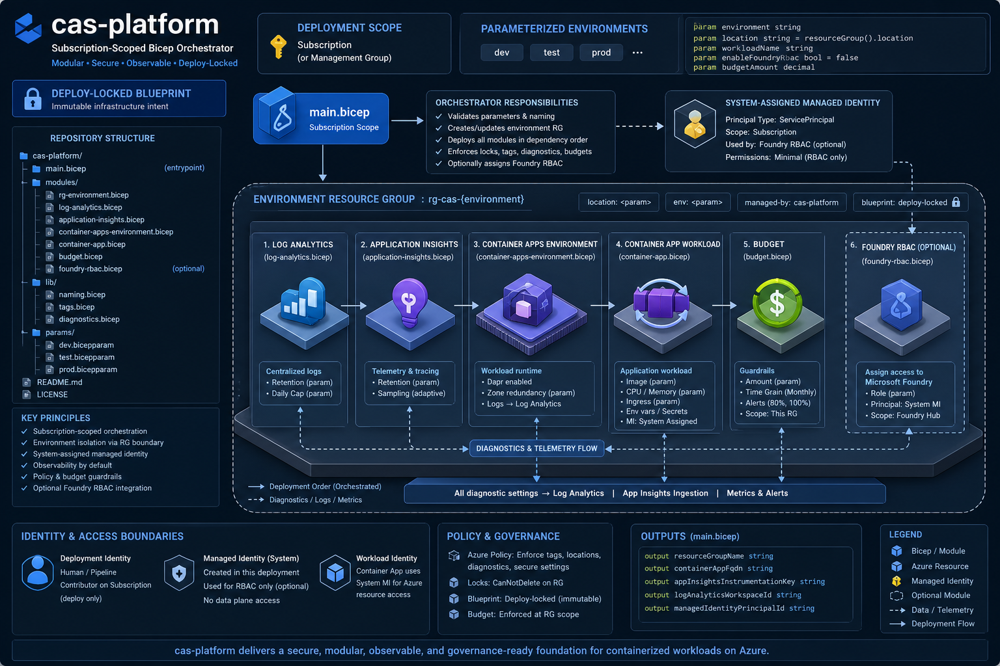
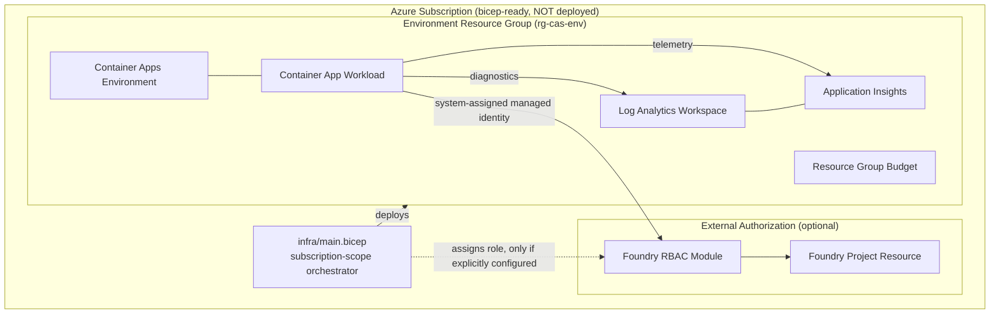

# Architecture

`cas-platform` is a modular, subscription-scoped Bicep orchestration model with environment
isolation, a strict system-assigned-managed-identity boundary, and workspace-based
observability. The workload module implements the public `cas-reference-product` deployment
interface.

<!-- codex:generate-image prompt="A pristine architectural blueprint on a drafting table under glass, fully inked and stamped approved, but a padlocked steel gate stands in front of the physical construction site behind it labeled deployment locked; isometric, enterprise blue/graphite palette" style="isometric, enterprise, clean" replaces="mermaid-above" -->

## Environment model

Dev, test, and production environments share the exact same module graph; variation is handled
entirely through parameter files (log retention, workload sizing, ingress configuration, budget
limits). Each environment gets its own isolated resource group, telemetry workspace, compute
environment, identity boundary, and budget.

## Identity and networking

The core workload relies exclusively on a **system-assigned managed identity**. Foundry access
is optional and disabled by default — a role is assigned only at the explicit Foundry project
scope when both a project resource ID and role definition ID are supplied; there are no
subscription-wide assignments. External ingress is disabled by default; private networking is
deferred until a target landing-zone contract is established.

## Deployment lock (NO-AZURE posture)

This repository's Bicep graph is validated (`./scripts/validate.ps1`, linting, subscription-scope
`what-if`) but **never deployed** from this workspace. Per the workspace-wide hard lock: no
Azure service or resource may be provisioned, deployed, or configured from any project under
this workspace — everything runs locally, and cloud hosting is revisited only in a future,
deliberately-scoped milestone. `cas-platform` is "bicep-ready" — linted, parameterized, and
(pending PR #11) API-version-pinned — precisely so that when the lock is lifted, deployment is a
reviewed authorization step, not a design exercise.

## Change safety

1. Linting (`bicepconfig.json` core analyzer ruleset) and contract tests.
2. Subscription-level `what-if` validation (never a live deploy).
3. Explicit deployment authorization — not yet exercised in this repo.

<!-- docs-verified: c1585ee195b72c5282f278c98da28c60da75667c 2026-07-08 -->
